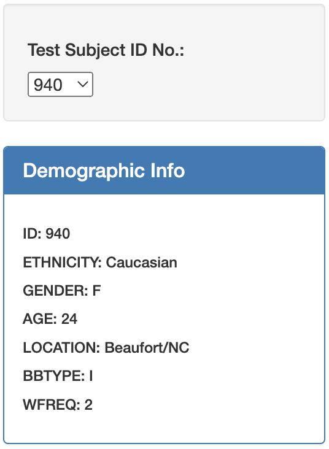
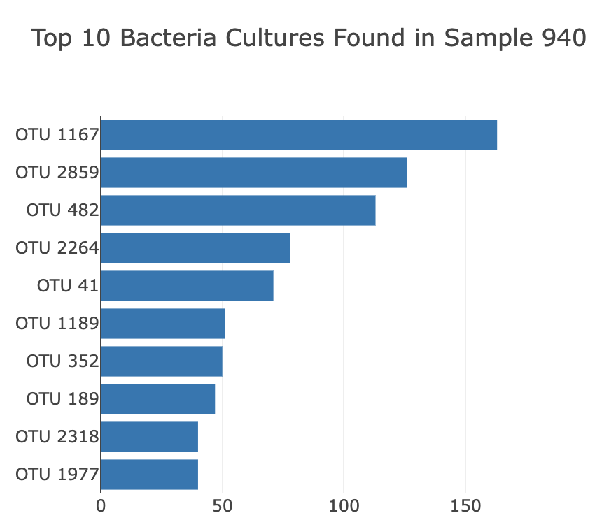
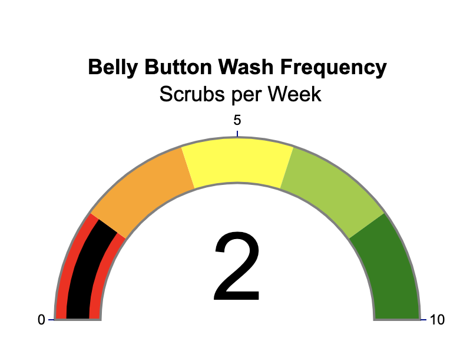

# navel_biodiversity

## Webpage URL
https://joeyamyers.github.io/navel_biodiversity/

## Overview
### Purpose
Researchers are interested in bacteria that synthesize proteins that taste like beef. They have teamed up with the start-up, Improbable Beef, to research candidate species that will provide the perfect taste. Researchers have hypothesized the microorganism that can provide the best taste commonly resides in the human belly button. Researchers have collected bacterial samples from the participants, and they have been assigned an ID number to view their results. Included on the dashboard are the individualized results of the bacteria collected from each participant's navel along with other pertinent information.

## Interactivity
Each volunteer can navigate to the dashboard and select their ID number from the dropdown menu to view their results from the study.
### Demographic Info
   

### Bacteria Cultures Present in Sample
   
This bar chart displays the count of each bacteria found in each sample's navel.

### Wash Frquency
   

This gauge chart visualizes how many times a volunteer washed their navel per week.
### Bacteria Count per Sample

   
This bubble chart also shows the count of each bacteria found in each sample's navel.

Tools:
* JavaScript
* HTML
* CSS

